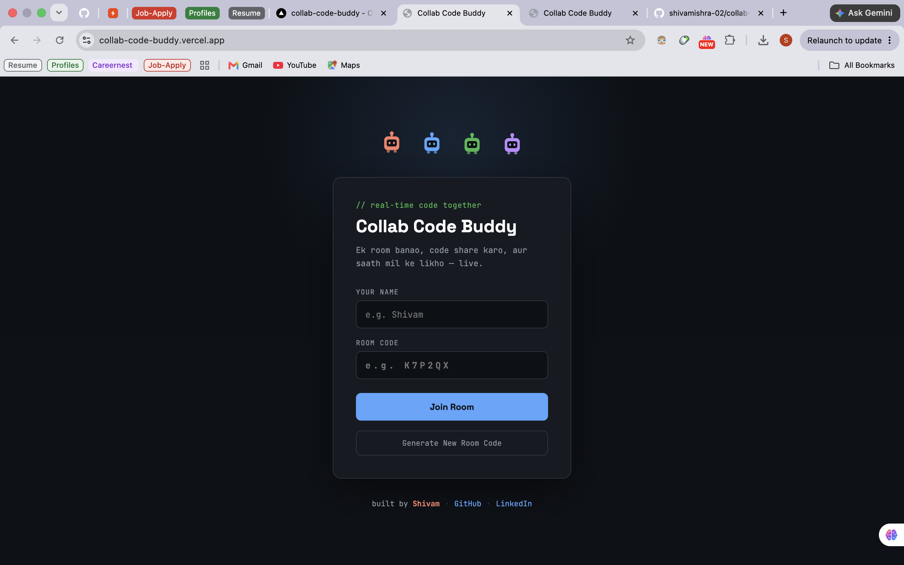
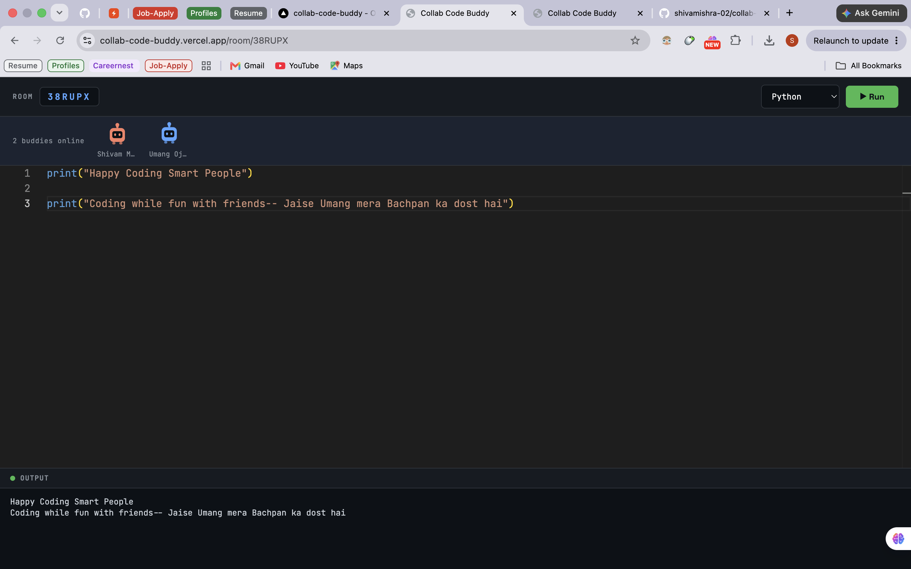
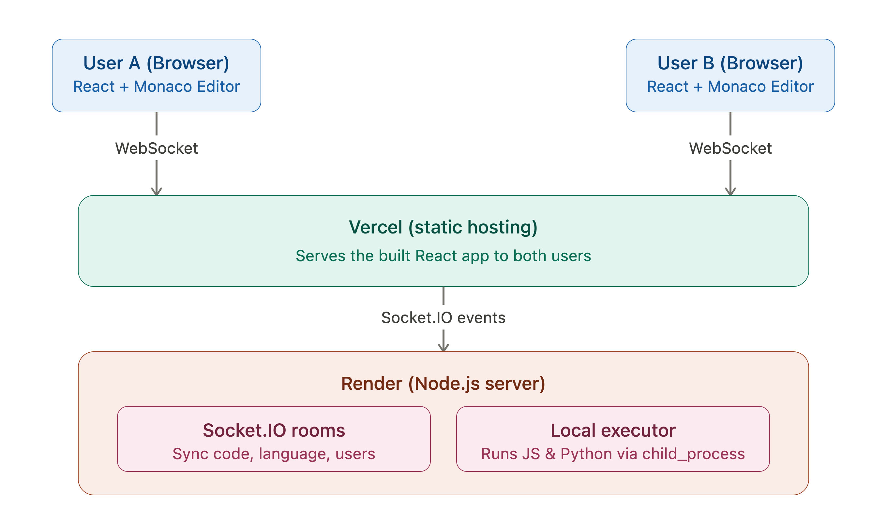

<div align="center">

# 🤖 Collab Code Buddy

### Real-time collaborative code editor — code together, debug together, ship together.

[](https://collab-code-buddy.vercel.app/)
[](https://collab-code-buddy.onrender.com/)
[](https://github.com/shivamishra-02/collab-code-buddy)


</div>

---

> **Don't feel like coding alone? Bring your friends in!**
>
> Whether it's DSA practice, interview prep, or just building something fun — spin up a room on **Collab Code Buddy**, share a 6-character code with your friends, and code together in real time. Write, run, and debug code side by side — way more fun (and motivating) than grinding solo. Create a room and get started! 🚀

<div align="center">
  
</div>

---

## ✨ Features

- **Real-time collaborative editor** — whatever one user types is instantly reflected for everyone else, powered by Socket.IO
- **Short room codes** — easy-to-share 6-character uppercase alphanumeric codes (e.g. `K7P2QX`)
- **Live code execution** — run JavaScript and Python directly from the browser
- **Animated buddy characters** — every connected user gets a small animated character with their own unique color
- **Language switcher** — switch between JS and Python instantly, synced for everyone in the room
- **Zero setup for users** — just enter a name and room code, and start coding

<div align="center">
  
</div>

---

## 🛠️ Tech Stack & Why It's Used

| Layer | Technology | Why it's used |
|---|---|---|
| Frontend | React (Vite) | Fast dev experience, component-based UI |
| Code Editor | Monaco Editor | The same editor that powers VS Code — syntax highlighting, auto-indent, and more, built in |
| Real-time sync | Socket.IO | Maintains a persistent connection between client and server, so the server can instantly push updates to all clients without them having to ask — this is the core of the real-time collaboration |
| Backend | Node.js + Express | Lightweight server that pairs seamlessly with Socket.IO |
| Code Execution | Node `child_process` | Writes the submitted code to a temporary file and runs it with `node`/`python3`, capturing the output with a timeout for safety |
| Hosting (Frontend) | Vercel | Free static hosting with automatic deploys from GitHub |
| Hosting (Backend) | Render | Free Node web service hosting, no credit card required |

---

## 🏗️ Architecture

<div align="center">
  
</div>

**High-level flow:**

1. Both users open the app in their browser — the React app is served by Vercel.
2. Both users connect to the backend (hosted on Render) via Socket.IO using the same Room ID, joining the same "room."
3. When User A types code, a `code-change` event is sent to the server, which broadcasts a `code-update` event to everyone else in that room.
4. When "Run" is clicked, the server writes the code to a temporary file, executes it with `node` or `python3`, and sends the output back to everyone in the room.

---

## 📂 Project Structure

```
collab-code-buddy/
├── client/                 # React frontend
│   ├── src/
│   │   ├── components/
│   │   │   ├── Buddy.jsx       # Animated character (one per user)
│   │   │   ├── BuddyBar.jsx    # Row of all connected buddies
│   │   │   ├── Editor.jsx      # Monaco editor wrapper
│   │   │   └── Output.jsx      # Code execution output panel
│   │   ├── pages/
│   │   │   ├── Home.jsx        # Room create/join screen
│   │   │   └── Room.jsx        # Main editor screen
│   │   ├── socket.js        # Socket.IO client setup
│   │   ├── App.jsx
│   │   └── index.css        # Design tokens & buddy animations
│   └── package.json
│
├── server/                  # Node backend
│   ├── index.js             # Express + Socket.IO server, room logic
│   ├── executor.js          # Runs JS/Python code safely with a timeout
│   └── package.json
│
└── README.md
```

---

## 🚀 Running Locally

### Backend
```bash
cd server
npm install
npm run dev
```
The server runs on `http://localhost:5000`.

### Frontend
```bash
cd client
npm install
npm run dev
```
The app opens at `http://localhost:5173`.

> **Note:** To run Python code locally, `python3` (or `python` on Windows) must be installed on your machine.

---

## 🌍 Deployment

This project is deployed across **two separate platforms**:

### 1. Backend → [Render](https://render.com)
- Root directory: `server`
- Build command: `npm install`
- Start command: `npm start`
- Environment variable: `CLIENT_URL` = the Vercel frontend URL (used for CORS)
- Free tier — spins down after 15 minutes of inactivity, so the first request after a while may take 30-60 seconds

### 2. Frontend → [Vercel](https://vercel.com)
- Root directory: `client`
- Framework preset: Vite (auto-detected)
- Environment variable: `VITE_SERVER_URL` = the Render backend URL

<div align="center">

### 🔗 [**Try it live →**](https://collab-code-buddy.vercel.app/)

</div>

---

## ⚠️ Known Limitations

- Currently supports only **JavaScript** and **Python** (perfect for loops, recursion, and standard logic)
- Execution timeout is **7 seconds** — infinite loops or heavy computations will time out
- The backend is on a free tier, so the first request after inactivity may be slow

---

## 👤 About the Developer

Built with ☕ and a lot of late-night debugging by **Shivam Mishra**.

[](https://github.com/shivamishra-02)
[](https://www.linkedin.com/in/shivam-mishra-3a741b253/)

If you found this project useful, drop a ⭐ — and if you spot a bug or have a feature idea, feel free to open an issue!

---

<p align="center">Made for everyone who'd rather <b>debug together</b> than alone. 🧑‍💻🤝🧑‍💻</p>